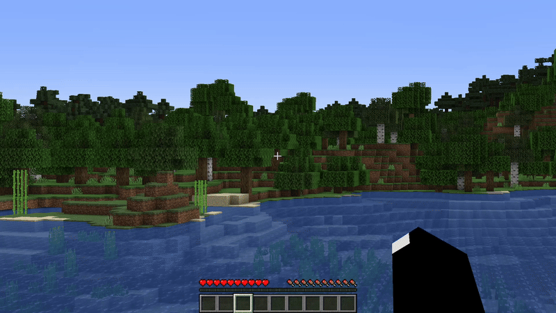

Modrinth | Hangar | SpigotMC
# Trolled
Full-configurable minecraft plugin for trolling players on your server.

For open troll menu: use /trolled (player-name)

### Troll functions
All functions can be fully configurable.
- Blow up the player.
- Make what do you want with player inventory.
- Kick player with reason. Realized in "vanilla" how fake /ban.
- Message to player. Realized in "vanilla" how fake /op.
- Play any sound to player.
- Teleport a player relative to his location. Realized how teleport to +100.000 Y

---

### Permission
The plugin has one permission that gives access to /trolled command. Without this command impossibly to use the plugin.
- **trolled.permission**

---

### Build
uses **gradle 8.12** and **java 17**

1. Download or clone this project
2. Change the code
3. Build
